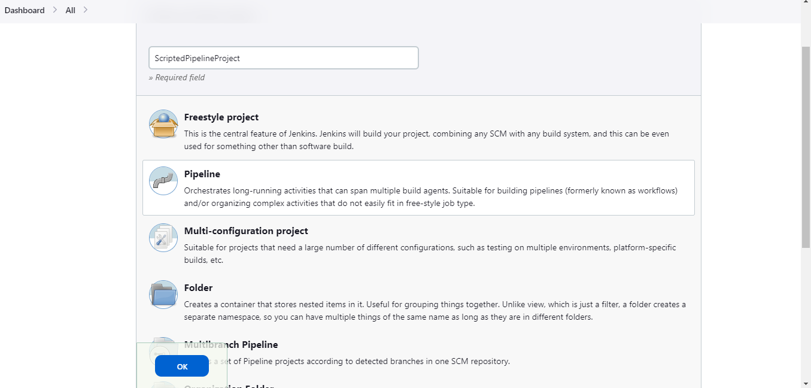

# DevOps
DevOps is a set of practices that combines software development (Dev) and IT operations (Ops) to shorten the systems development life cycle and provide continuous delivery with high software quality. 

Jenkins is a popular DevOps tool that helps teams automate their software development process and achieve continuous integration, continuous delivery, and continuous deployment. 

By using Jenkins, teams can streamline their DevOps pipeline and optimize their software delivery process, resulting in faster time-to-market and higher-quality software.


## Steps in DevOps

* Version control: Source code management
* Continuous Integration (CI): Build ,compile, validate, review, testing
* Continuous Delivery: Deploy in test server
* Continuous Deployment (CD): Deploy in production server


# Jenkins

**Jenkins** is an open-source automation server used for building, testing, and deploying software applications. It automates the non-human part of the software development process, thereby freeing up developers' time to focus on more critical tasks.

Some of the key features of Jenkins include continuous integration, continuous delivery, and continuous deployment. 

By automating the build, test, and deployment processes, Jenkins enables teams to detect and fix issues early in the development cycle, resulting in faster time-to-market and higher-quality software.

Jenkins is highly customizable and has over 1,500 plugins available to extend its functionality. It supports a wide range of programming languages and integrates with many popular tools and services such as GitHub, Docker, and AWS.

Overall, Jenkins is a powerful automation server that can help teams of all sizes streamline their software development process and deliver better software faster.


## Getting Started with Jenkins (Install with docker) 

* Open your browser at localhost 8080
    
* Get the password from the docker container logs 

```
    docker logs {JenkincontainerId}
    Ex: docker logs ebfa

```

    
    

* Copy the password & paste it
* Select **Install suggested plugins** & wait till the process completes
* Once process completes, it redirects to,
    
* Create user & fill up the details , save & continue
* Click save and finish 
* Now you can access jenkins in localhost:8080 with your created user & password
        

> NOTE: In our demos, we are working on Jenkin on docker 

## Jenkins Plugins
By default, Jenkins comes with a limited set of features. If you want to integrate your Jenkins installation with version control tools like Git, then you need to install plugins related to Git. In fact, for integration with tools like Maven, Amazon EC2, you need to install respective plugins in your Jenkins.


## Creating Jobs in Jenkins 

Jobs are the heart of Jenkins's build process. 

A job can be considered as a particular task to achieve a required objective in Jenkins. 

Moreover, we can create as well as build these jobs to test our application or project. 

Jenkins provides the following types of build jobs, that a user can create on a need basis. Consequently, the following image highlights a few of the Jenkins build jobs, which are used very frequently these days:


| Options | Description|
|-------  | ----------|
| Freestyle Project | Freestyle Project in Jenkins is an improvised or unrestricted build job or task with multiple operations. Operations can be a build, pipeline run, or any script run.|
| Maven Project	| Maven project is selected for managing as well as building the projects which contain POM files. Jenkins will automatically pick the POM files, make configurations, and run our build.|
|Pipeline| Pipeline demonstrates long-running activities that contain multiple build agents. It is suitable for running pipelines that cannot run through normal freestyle type jobs.|
|Multi-configuration Project|This option is suitable in those conditions where different configurations like testing on multiple environments, platform-specific builds are required.|
|GitHub Organization	|This option scans the User’s GitHub account for all repositories matching some defined markers.|

### Example 1 - Creating First Jenkin Job:

Steps:

* Click on new item 


* Select freestyle project 

* Give Projet name - `My_First_Jenkin_Job`

* Select freestyle project option 


* Click on ok


* Write the description `My first jenkin job`

* Scroll to the **_Build Steps section_**


* Add a build step -> Select **_Execute shell_**


Add this :

```
    echo "This is my first jenkins job"
```
    

* Apply and close 

* Click on Build now to run your first job 

* You can see the status of your build by expanding **Build History**


### Example 2 - Build Simple Java Application by pulling code from git repository

Pull the code from the remote repository and build the simple java application 

**Prerequisites:** Let us take a simple java project exists in the git hub (https://github.com/Thanu-personal/Hello-world.git)

* Create new item 
* Give the name `Hello_World_Jenkin_Project`
* Select freestyle project and click ok 
* Write the description `Hello_World_Jenkin_Project`
* Scroll down to the **_Source Code Management_** section 
* Select GIT 

    * Give the remote repo url , username and password
    <br>
> NOTE: Im using already existing public repository  `https://github.com/Thanu-personal/Hello-world.git` 
    
    * Scroll down & select the git branch `main`

* Go to **_Build Steps_**

    * Add a build step -> Select **_Execute shell_**
    Add this :
    
    ```
    cd src
    javac HelloWorld.java
    java HelloWorld

    ```
* Apply and close 
* Click on Build now to run your **`Hello_World_Jenkin_Project`** 
  


## Jenkins Pipeline
Jenkins Pipeline is a suite of plugins which supports implementing and integrating continuous delivery pipelines into Jenkins.

The definition of a Jenkins Pipeline is written into a text file (called a _Jenkinsfile_) which in turn can be committed to a project’s source control repository.

**Creating a Jenkinsfile and committing it to source control provides a number of immediate benefits:** 

> Automatically creates a Pipeline build process for all branches and pull requests. 

> Code review/iteration on the Pipeline (along with the remaining source code).

> Audit trail for the Pipeline.

> Single source for the Pipeline which can be viewed and edited by multiple members of the project. 


## Pipeline Concepts

A Pipeline is a user-defined model of a CD pipeline. A Pipeline’s code defines your entire build process, which typically includes stages for building an application, testing it and then delivering it.

>**_Pipeline_** : A Pipeline is a user-defined model of a CD pipeline. A Pipeline’s code defines your entire build process, which typically includes stages for building an application, testing it and then delivering it.<br>
> **_Node_** : A node is a machine which is part of the Jenkins environment and is capable of executing a Pipeline.<br>
>**_Stage_** : A stage block defines a conceptually distinct subset of tasks performed through the entire Pipeline (e.g. "Build", "Test" and "Deploy" stages)<br>
>**_Step_** : A single task. Fundamentally, a step tells Jenkins what to do at a particular point in time.

## Jenkins File
A _Jenkinsfile_ is a text file that contains the definition of a Jenkins Pipeline and is checked into source control or written directly in _groovy_ script.

### Creating Jenkinsfile

A Jenkinsfile can be written using two types of syntax - `Declarative` and `Scripted`.

#### Declarative Pipeline

Declarative piplelines are the jenkins file written and checked into SCM.

**Syntax:**

```
pipeline {
    agent any 
    stages {
        stage('Build') { 
            steps {
                // 
            }
        }
        stage('Test') { 
            steps {
                // 
            }
        }
        stage('Deploy') { 
            steps {
                // 
            }
        }
    }
}
```

> **_agent any_** : Execute this pipeline on available agent.<br>
> **_stage('xyz')_** : Defines the "Build" stage.<br>
> **_steps_** : Perform the steps related to the stage "xyz".
<br>


##### Example
**Prerequisites**: Have a simple demo project with the jenkins file in git repository (https://github.com/Thanu-personal/JenkinDeclarativePipeline.git)

    * From the Jenkins Dashboard, select _new item_
    
    * Give a name `Declarative_pipeline_project`
    
    * Select project type `Pipeline Project`
    
    * Click ok
    
    
    
   
    * Now configure, 
        * Scroll to the pipeline section. 

        * Select `pipeline script from SCM`

        * Give the git repository url & credentials and the branch details. You can leave credentials **none** if it is a **public** repository
        

        * Go to the script path & select the path to jenkins file (In my case it is _JenkinsFile_ in the _main directory_)
        * Apply and save 
        * Now click on `build now`
        

        * You can observe that the build succeeded and observe the console output
            * The source code is pulled from the git 
            * Located JenkinsFile 
            * Run the stages described in JenkinsFile
            
            


#### Scripted pipeline

Scripted piplelines are the executable shell scripts directly written using ***groovy syntax***

**Syntax:**

```
node {  
    stage('Build') { 
        // 
    }
    stage('Test') { 
        // 
    }
    stage('Deploy') { 
        // 
    }
}
```

> **_node_**: Execute this Pipeline or any of its stages, on any available agent.<br>
> **_stage('xyz')_**: Defines 'xyz' stage.

##### Example

> Note: We use the same previous example. But instead of using JenkinsFile in SCM, we write script directly in the input box

    * From the Jenkins Dashboard, select _new item_
    
    * Give a name `Scripted_pipeline_project`
    
    * Select project type `Pipeline Project`
    
    * Click ok
    
    
    
   
    * Now configure, 
        * Scroll to the pipeline section. 

        * Select `pipeline script`

        * Write the script in the input box 

     

    ```javascript
      
        node {
                stage('Build') { 
                    echo "This is build step"
                }
            stage('Test') { 
                    echo "This is Test step"
            }
            stage('Deploy') { 
                    echo "This is Deploy step"
            }
        }
    
      
    ```
        
* Apply and save 
        
* Now click on `build now`
        

* You can observe that the build succeeded and observe the console output
        
            

## Jenkins Distributed Architecture


Jenkins uses a Master-Slave architecture to manage distributed builds. 

In this architecture, Master and Slave communicate through TCP/IP protocol.

**Jenkins Master:**

Your main Jenkins server is the Master. The Master’s job is to handle:

* Scheduling build jobs.
* Dispatching builds to the slaves for the actual execution.
* Monitor the slaves (possibly taking them online and offline as required).
* Recording and presenting the build results.

A Master instance of Jenkins can also execute build jobs directly.

**Jenkins Slave:**

A Slave is a Java executable that runs on a remote machine. Following are the characteristics of Jenkins Slaves:

* It hears requests from the Jenkins Master instance.
* Slaves can run on a variety of operating systems.

The job of a Slave is to do as they are told to, which involves executing build jobs dispatched by the Master.

You can configure a project to always run on a particular Slave machine or a particular type of Slave machine, or simply let Jenkins pick the next available Slave.

## How Jenkins Master and Slave Architecture works?

Now let us look at an example in which we use Jenkins for testing in different environments like Ubuntu, Windows, Docker etc.

The diagram below represents the same:


Jenkins checks the Git repository at periodic intervals for any changes made in the source code.

Each builds requires a different testing environment which is not possible for a single Jenkins server. In order to perform testing in different environments, Jenkins uses various Slaves as shown in the diagram.

Jenkins Master requests these Slaves to perform testing and to generate test reports.
