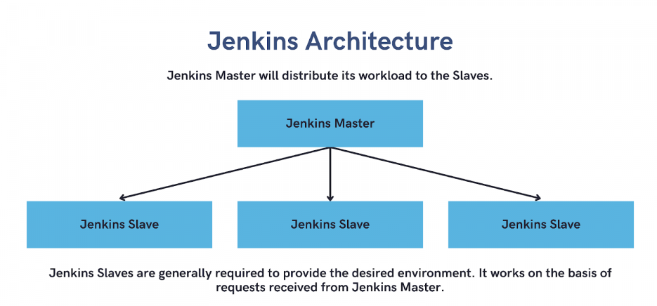
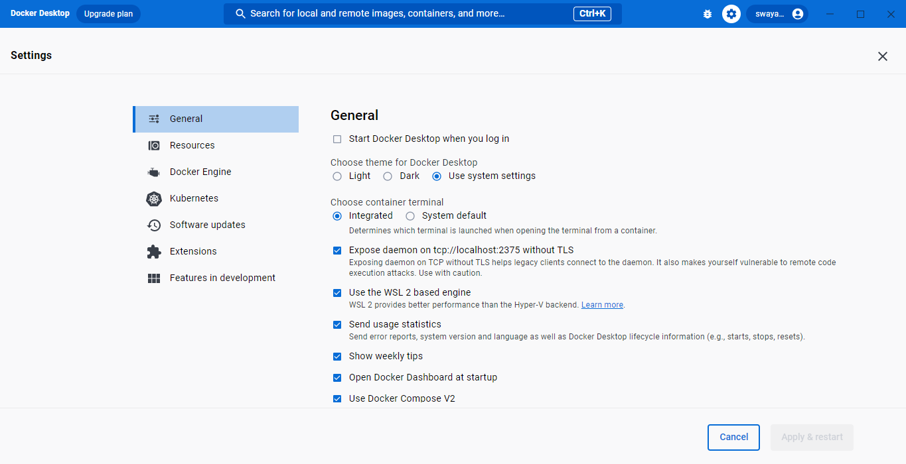

<!--
author:  Thanu

email:    thanu.nakshathra@gmail.com

version:  0.0.1

language: en

narrator: US English Female
script:   https://cdn.jsdelivr.net/chartist.js/latest/chartist.min.js
          https://felixhao28.github.io/JSCPP/dist/JSCPP.es5.min.js

import: https://raw.githubusercontent.com/LiaTemplates/algebrite/0.2.1/README.md 
        https://raw.githubusercontent.com/liaTemplates/TextAnalysis/main/README.md

-->

# DevOps
DevOps is a set of practices that combines software development (Dev) and IT operations (Ops) to shorten the systems development life cycle and provide continuous delivery with high software quality. 

Jenkins is a popular DevOps tool that helps teams automate their software development process and achieve continuous integration, continuous delivery, and continuous deployment. 

By using Jenkins, teams can streamline their DevOps pipeline and optimize their software delivery process, resulting in faster time-to-market and higher-quality software.


## Steps in DevOps

* Version control: Source code management
* Continuous Integration (CI): Build ,compile, validate, review, testing
* Continuous Delivery: Deploy in test server
* Continuous Deployment (CD): Deploy in production server


# Jenkins

**Jenkins** is an open-source automation server used for building, testing, and deploying software applications. It automates the non-human part of the software development process, thereby freeing up developers' time to focus on more critical tasks.

Some of the key features of Jenkins include continuous integration, continuous delivery, and continuous deployment. 

By automating the build, test, and deployment processes, Jenkins enables teams to detect and fix issues early in the development cycle, resulting in faster time-to-market and higher-quality software.

Jenkins is highly customizable and has over 1,500 plugins available to extend its functionality. It supports a wide range of programming languages and integrates with many popular tools and services such as GitHub, Docker, and AWS.

Overall, Jenkins is a powerful automation server that can help teams of all sizes streamline their software development process and deliver better software faster.


## Install Jenkins 

* [Install Jenkins on windows](#install-jenkins-on-windows)
* [Install Jenkins with Docker](#install-jenkins-with-docker)
* [Install Jenkins on MAC OS](#install-jenkins-with-docker)
* [Install Jenkins on Linux](#install-jenkins-with-docker)


### Install Jenkins on windows

**Prerequisites:**

* Install Java development kit  
* Set up environmental variables for jdk
* Download and install Jenkins 
    
    Download Jenkins for windows (LTS Version) [Download here](https://www.jenkins.io/download/thank-you-downloading-windows-installer-stable/)

    Install Jenkins  [Follow these steps](https://www.jenkins.io/doc/book/installing/windows/ )

On successful installation, you should be able to access Jenkins in localhost:8080 

### Install Jenkins with Docker

**Prerequisites:** Docker installed

1. Open up a command prompt window 
2. Create a bridge network in Docker

```
docker network create jenkins
```

3. Run the docker:dind Docker image 

```
docker run --name jenkins-docker --rm --detach --privileged --network jenkins --network-alias docker --env DOCKER_TLS_CERTDIR=/certs --volume jenkins-docker-certs:/certs/client --volume jenkins-data:/var/jenkins_home --publish 2376:2376 docker:dind

```

4. On download successful, customize official jenkins docker image by executing the below steps:
     
    1 Create a docker file (`Dockerfile`) in your folder structure with the following content 
        (In my case E:/JenkinsDocker)

``` 
FROM jenkins/jenkins:2.387.1
USER root
RUN apt-get update && apt-get install -y lsb-release
RUN curl -fsSLo /usr/share/keyrings/docker-archive-keyring.asc https://download.docker.com/linux/debian/gpg
RUN echo "deb [arch=$(dpkg --print-architecture) signed-by=/usr/share/keyrings/docker-archive-keyring.asc] https://download.docker.com/linux/debian $(lsb_release -cs) stable" > /etc/apt/sources.list.d/docker.list
RUN apt-get update && apt-get install -y docker-ce-cli
USER jenkins
RUN jenkins-plugin-cli --plugins "blueocean docker-workflow" 

```


5. Now go to the dockerfile directory & build the docker image 
    
```
cd E:/JenkinsDocker

docker build -t  myjenkins-blueocean:2.387.1-1 .

```
Now customised jenkin docker image is created successfully

 
6. Run the docker image 

```
docker run --name jenkins-blueocean --restart=on-failure --detach --network jenkins --env DOCKER_HOST=tcp://docker:2376 --env DOCKER_CERT_PATH=/certs/client --env DOCKER_TLS_VERIFY=1 --publish 8080:8080 --publish 50000:50000 --volume jenkins-data:/var/jenkins_home --volume jenkins-docker-certs:/certs/client:ro myjenkins-blueocean:2.387.1-1

```

> NOTE: You can skip step 3 to step 6 and directly download the customised docker image from the docker hub and run the docker image 

```
docker pull swayaanthanu/myjenkin-blueocean-v2.387.1-1:latest

docker run --name jenkins-blueocean --restart=on-failure --detach --network jenkins --env DOCKER_HOST=tcp://docker:2376 --env DOCKER_CERT_PATH=/certs/client --env DOCKER_TLS_VERIFY=1 --publish 8080:8080 --publish 50000:50000 --volume jenkins-data:/var/jenkins_home --volume jenkins-docker-certs:/certs/client:ro swayaanthanu/myjenkin-blueocean-v2.387.1-1

```

Now you have successfully installed jenkins docker & you should be able to access jenkins Home page in your browser on http://localhost:8080


## Getting Started with Jenkins (Install on windows) 

* Open your browser at localhost 8080
    
* Get the password from the path given above and paste it and click continue 
    
* Select **Install suggested plugins** & wait till the process completes
* Once process completes, it redirects to,
    
* Create user & fill up the details , save & continue
* Click save and finish 
* Now you can access jenkins in localhost:8080 with your created user & password
    


## Getting Started with Jenkins (Install with docker) 

* Open your browser at localhost 8080
    
* Get the password from the docker container logs 

```
    docker logs {JenkincontainerId}
    Ex: docker logs ebfa

```

    
    

* Copy the password & paste it
* Select **Install suggested plugins** & wait till the process completes
* Once process completes, it redirects to,
    
* Create user & fill up the details , save & continue
* Click save and finish 
* Now you can access jenkins in localhost:8080 with your created user & password
        

> NOTE: In our demos, we are working on Jenkin on docker 

## Jenkins Plugins
By default, Jenkins comes with a limited set of features. If you want to integrate your Jenkins installation with version control tools like Git, then you need to install plugins related to Git. In fact, for integration with tools like Maven, Amazon EC2, you need to install respective plugins in your Jenkins.


## Creating Jobs in Jenkins 

Jobs are the heart of Jenkins's build process. 

A job can be considered as a particular task to achieve a required objective in Jenkins. 

Moreover, we can create as well as build these jobs to test our application or project. 

Jenkins provides the following types of build jobs, that a user can create on a need basis. Consequently, the following image highlights a few of the Jenkins build jobs, which are used very frequently these days:


| Options | Description|
|-------  | ----------|
| Freestyle Project | Freestyle Project in Jenkins is an improvised or unrestricted build job or task with multiple operations. Operations can be a build, pipeline run, or any script run.|
| Maven Project	| Maven project is selected for managing as well as building the projects which contain POM files. Jenkins will automatically pick the POM files, make configurations, and run our build.|
|Pipeline| Pipeline demonstrates long-running activities that contain multiple build agents. It is suitable for running pipelines that cannot run through normal freestyle type jobs.|
|Multi-configuration Project|This option is suitable in those conditions where different configurations like testing on multiple environments, platform-specific builds are required.|
|GitHub Organization	|This option scans the User’s GitHub account for all repositories matching some defined markers.|

### Example 1 - Creating First Jenkin Job:

Steps:

* Click on new item 


* Select freestyle project 

* Give Projet name - `My_First_Jenkin_Job`

* Select freestyle project option 


* Click on ok


* Write the description `My first jenkin job`

* Scroll to the **_Build Steps section_**


* Add a build step -> Select **_Execute shell_**


Add this :

```
    echo "This is my first jenkins job"
```
    

* Apply and close 

* Click on Build now to run your first job 

* You can see the status of your build by expanding **Build History**


### Example 2 - Build Simple Java Application by pulling code from git repository

Pull the code from the remote repository and build the simple java application 

**Prerequisites:** Let us take a simple java project exists in the git hub (https://github.com/Thanu-personal/Hello-world.git)

* Create new item 
* Give the name `Hello_World_Jenkin_Project`
* Select freestyle project and click ok 
* Write the description `Hello_World_Jenkin_Project`
* Scroll down to the **_Source Code Management_** section 
* Select GIT 

    * Give the remote repo url , username and password
    <br>
> NOTE: Im using already existing public repository  `https://github.com/Thanu-personal/Hello-world.git` 
    
    * Scroll down & select the git branch `main`

* Go to **_Build Steps_**

    * Add a build step -> Select **_Execute shell_**
    Add this :
    
    ```
    cd src
    javac HelloWorld.java
    java HelloWorld

    ```
* Apply and close 
* Click on Build now to run your **`Hello_World_Jenkin_Project`** 
  


## Jenkins Pipeline
Jenkins Pipeline is a suite of plugins which supports implementing and integrating continuous delivery pipelines into Jenkins.

The definition of a Jenkins Pipeline is written into a text file (called a _Jenkinsfile_) which in turn can be committed to a project’s source control repository.

**Creating a Jenkinsfile and committing it to source control provides a number of immediate benefits:** 

> Automatically creates a Pipeline build process for all branches and pull requests. 

> Code review/iteration on the Pipeline (along with the remaining source code).

> Audit trail for the Pipeline.

> Single source for the Pipeline which can be viewed and edited by multiple members of the project. 


## Pipeline Concepts

A Pipeline is a user-defined model of a CD pipeline. A Pipeline’s code defines your entire build process, which typically includes stages for building an application, testing it and then delivering it.

>**_Pipeline_** : A Pipeline is a user-defined model of a CD pipeline. A Pipeline’s code defines your entire build process, which typically includes stages for building an application, testing it and then delivering it.<br>
> **_Node_** : A node is a machine which is part of the Jenkins environment and is capable of executing a Pipeline.<br>
>**_Stage_** : A stage block defines a conceptually distinct subset of tasks performed through the entire Pipeline (e.g. "Build", "Test" and "Deploy" stages)<br>
>**_Step_** : A single task. Fundamentally, a step tells Jenkins what to do at a particular point in time.

## Jenkins File
A _Jenkinsfile_ is a text file that contains the definition of a Jenkins Pipeline and is checked into source control or written directly in _groovy_ script.

### Creating Jenkinsfile

A Jenkinsfile can be written using two types of syntax - `Declarative` and `Scripted`.

#### Declarative Pipeline

Declarative piplelines are the jenkins file written and checked into SCM.

**Syntax:**

```
pipeline {
    agent any 
    stages {
        stage('Build') { 
            steps {
                // 
            }
        }
        stage('Test') { 
            steps {
                // 
            }
        }
        stage('Deploy') { 
            steps {
                // 
            }
        }
    }
}
```

> **_agent any_** : Execute this pipeline on available agent.<br>
> **_stage('xyz')_** : Defines the "Build" stage.<br>
> **_steps_** : Perform the steps related to the stage "xyz".
<br>


##### Example
**Prerequisites**: Have a simple demo project with the jenkins file in git repository (https://github.com/Thanu-personal/JenkinDeclarativePipeline.git)

    * From the Jenkins Dashboard, select _new item_
    
    * Give a name `Declarative_pipeline_project`
    
    * Select project type `Pipeline Project`
    
    * Click ok
    
    
    
   
    * Now configure, 
        * Scroll to the pipeline section. 

        * Select `pipeline script from SCM`

        * Give the git repository url & credentials and the branch details. You can leave credentials **none** if it is a **public** repository
        

        * Go to the script path & select the path to jenkins file (In my case it is _JenkinsFile_ in the _main directory_)
        * Apply and save 
        * Now click on `build now`
        

        * You can observe that the build succeeded and observe the console output
            * The source code is pulled from the git 
            * Located JenkinsFile 
            * Run the stages described in JenkinsFile
            
            


#### Scripted pipeline

Scripted piplelines are the executable shell scripts directly written using ***groovy syntax***

**Syntax:**

```
node {  
    stage('Build') { 
        // 
    }
    stage('Test') { 
        // 
    }
    stage('Deploy') { 
        // 
    }
}
```

> **_node_**: Execute this Pipeline or any of its stages, on any available agent.<br>
> **_stage('xyz')_**: Defines 'xyz' stage.

##### Example

> Note: We use the same previous example. But instead of using JenkinsFile in SCM, we write script directly in the input box

    * From the Jenkins Dashboard, select _new item_
    
    * Give a name `Scripted_pipeline_project`
    
    * Select project type `Pipeline Project`
    
    * Click ok
    
    
    
   
    * Now configure, 
        * Scroll to the pipeline section. 

        * Select `pipeline script`

        * Write the script in the input box 

     

    ```javascript
      
        node {
                stage('Build') { 
                    echo "This is build step"
                }
            stage('Test') { 
                    echo "This is Test step"
            }
            stage('Deploy') { 
                    echo "This is Deploy step"
            }
        }
    
      
    ```
        
* Apply and save 
        
* Now click on `build now`
        

* You can observe that the build succeeded and observe the console output
        
            

## Jenkins Distributed Architecture



Jenkins uses a Master-Slave architecture to manage distributed builds. 

In this architecture, Master and Slave communicate through TCP/IP protocol.

**Jenkins Master:**

Your main Jenkins server is the Master. The Master’s job is to handle:

* Scheduling build jobs.
* Dispatching builds to the slaves for the actual execution.
* Monitor the slaves (possibly taking them online and offline as required).
* Recording and presenting the build results.

A Master instance of Jenkins can also execute build jobs directly.

**Jenkins Slave:**

A Slave is a Java executable that runs on a remote machine. Following are the characteristics of Jenkins Slaves:

* It hears requests from the Jenkins Master instance.
* Slaves can run on a variety of operating systems.

The job of a Slave is to do as they are told to, which involves executing build jobs dispatched by the Master.

You can configure a project to always run on a particular Slave machine or a particular type of Slave machine, or simply let Jenkins pick the next available Slave.

## How Jenkins Master and Slave Architecture works?

Now let us look at an example in which we use Jenkins for testing in different environments like Ubuntu, Windows, Docker etc.

The diagram below represents the same:


Jenkins checks the Git repository at periodic intervals for any changes made in the source code.

Each builds requires a different testing environment which is not possible for a single Jenkins server. In order to perform testing in different environments, Jenkins uses various Slaves as shown in the diagram.

Jenkins Master requests these Slaves to perform testing and to generate test reports.

### Set up Jenkin Master Slaves(Agent)

* Slaves can be set up in two ways:
    
    

   * [Configuring clouds as permanent agent](#configuring-agent-as-permanent-agent)
   * [Configuring nodes as temporary agent](#configuring-agent-as-temporary-agent)
    
#### Configuring Agent as permanent agent

* In the Jenkins dashboard, **Manage Jenkins -> Manage Nodes and Clouds -> New Node** to create a new node:


* Give the name `Slave1` and check the ***permanent agent*** option and click create
* You can also have a copy of the already existing agent 
* Configure new node 
  
  
  

** For more information on launch type, [See more Launch type](https://wiki.jenkins.io/display/JENKINS/Distributed+builds)

***For more configuration details, [See more configuration details](https://docs.cloudbees.com/docs/cloudbees-ci-kb/latest/client-and-managed-masters/host-key-verification-for-ssh-agents) ***

> Note: The Label given here is used later for assigning jobs to agent using ***Labels***

* Now  your slave is up and running.

lets execute a job on slave. For that I already have an existing job `My_First_Jenkin-Job`and I will run this job on this slave. Open this job and click on configure. 

Now here in the General section, click on “Restrict where this project can be run”. Here in Label Expression, enter the name of the slave `Slave` and save it. Now click on Build now and see the output of this job. Everything is correct you will see the output as Success.


#### Configuring Agent as temporary agent

Let us configure a ***docker container*** as a temporary agent.

**Prerequisites**: 

1. [Install Docker Plugin on Jenkins](#install-docker-plugin) 
2. **Configure a Docker Host With Remote API**: Jenkins master connects to the docker host using REST APIs. So we need to enable the remote API for our docker host.
        

    * On windows, Open the docker desktop -> Settings -> General -> Check the option `Expose daemon on tcp://localhost:2375 without TLS`
    
    * On Linux, Follow the link [Expose daemon on tcp://localhost:2375](https://docs.docker.com/config/daemon/remote-access)


#### Configuring Temporary agent 

To configure temporary agent using docker, 


Steps:

1. Docker Host With remote API enabled
    - Enable remote API on port 4243 - jenkins port - port shd be reachable from jenkin master 
    - Jenkins master to docker host - docker generic host ports frm 32768 to 60999 - for mster to communicate with doker agent 
2. Jenkins Slave Docker Image
    - ssh type 
    - jnlp type 
3. Jenkins Docker plugin 


Prerequisistes :
1. working jenkins master v-2.0
2. A server with docker 
    - allow traffic btn 4243 and 32768 - 60999 


Set up:

Since we are running jenkins as container, the container cannot reach docker host unix port. So we need to run another container that can mediate between docker host and jenkins container. It will publish docker host's unix port as its tcp port. 
[To create this socat container, follow the steps](#create-socat-container)

##### Install Docker Plugin 

```

Jenkins Dashboard -> Manage Plugins -> Available plugins -> Search for docker -> Install

```
If it is installed successfully, 
you should be able to see these plugins under ***installed plugins*** section 


* In the Jenkins dashboard, **Manage Jenkins -> Manage Nodes and Clouds -> Configure Clouds** 
* Now in configure clouds, you see docker as a option
* Select docker , give name to the node `Docker slave`

* Select apply and save


##### Create socat container
To create this socat container, [alpine/socat container to forward traffic from Jenkins to Docker Desktop on Host Machine]

[Know more..](https://stackoverflow.com/questions/47709208/how-to-find-docker-host-uri-to-be-used-in-jenkins-docker-plugin)

* Open the cmd prompt and run the following command
    
```
docker run -d --restart=always -p 127.0.0.1:2376:2375 --network jenkins -v /var/run/docker.sock:/var/run/docker.sock alpine/socat tcp-listen:2375,fork,reuseaddr unix-connect:/var/run/docker.sock
docker inspect <container_id> | grep IPAddress

```
- This should start a container that is going to proxy the connection from our jenkins master container.

* Now inspect this container and get the ip address

```
docker inspect container_id;

```

* Jump back to jenkin, configure clouds.
* Select Docker -> Give name 'Agent1'
* Expand Docker cloud details ,
    Docker host uri - IP Address of the socat container - tcp://ipaddress:2375
    ex: tcp://172.18.0.3:2375
* Test connection should be succeeded with the version shown below


[On connection success, you should be able to set docker agent templates and run your jobs](#create-docker-template-and-run-the-job-using-this-agent)


#### Create docker template and run the job using this agent

* From Dashboard -> Manage Jenkins -> Configure Clouds 
* Expand Docker Agent Templates 
* Let us configure a sample agent template, for this we are using a pre existing image from the docker hub `jenkins/agent:alpine`
    * Label: Let us label it as `docker-slave` (This label is used to assign jobs later on )
    * Enabled: Check Enabled 
    * Name: Lets name it as `docker-slave`
    * Docker Image: jenkins/agent:alpine
    * Instance capacity: For now, I will choose 1 
    * Remote File Syatem Root: /home/jenkins 
    * Usage: Only build with label expressions matching this node
    * Connect method: Attch Docker container 
    * Apply save 


* Now let us assign a job to this agent creted and test the build
    * For this, i will choose one of the existing project `Hello_World_Jenkin_Project`
    * Go to configure,
    * Select `Restrict where this project can be run` and type the `Label Expression` as  ***docker-slave*** (This is the label we had given to the agent while configuring)
    
    
    
    
    * Apply and save & build the project 
    

    * Open in blue ocean and view better
    


#### Create your own docker image to build your application (Hands On)

Docker images we supply should be able to function as a "standalone agent" or a "node". This means the images should have basic applications installed on it (sshd, java, git, maven etc.)
   
    *   You can pull a docker image which has required applications installed from the github 
   

```
docker pull swayaanthanu/image-java-git-mvn:latest

```
     OR

* You can create your own image, [Create your own build image](#create-a-docker-build-image)
* Now run your docker image as container 

```
docker run imageName /bin/bash

In my case,

docker run swayaanthanu/image-java-git-mvn 

```

* Get the ip address by executing the cmd 

```
docker inspect <contianer_id>

```

***Keep this address to configure node in Jenkins***


> Note that, The default ssh username is jenkins and the password is also jenkins as per the given Dockerfile. You will have to use these credentials in the below configuration.


### Additional Information 

* [Create a Docker build image](#create-a-docker-build-image)
* [Jenkins added volumes](#jenkins-added-volumes)


##### Create a Docker build image 

* Create a docker file with the following content 

*** Dockerfile content ***

```

FROM ubuntu:22.04

LABEL maintainer="Thanu shree <thanushree@swayaan.com>"

# Make sure the package repository is up to date.
RUN apt-get update && \
    apt-get -qy full-upgrade && \
    apt-get install -qy git && \
# Install a basic SSH server
    apt-get install -qy openssh-server && \
    sed -i 's|session    required     pam_loginuid.so|session    optional     pam_loginuid.so|g' /etc/pam.d/sshd && \
    mkdir -p /var/run/sshd && \
# Install JDK 11 (latest stable edition at 2019-04-01)
    apt-get install -qy openjdk-11-jdk && \
# Install maven
    apt-get install -qy maven && \
# Cleanup old packages
    apt-get -qy autoremove && \
# Add user jenkins to the image
    adduser --quiet jenkins && \
# Set password for the jenkins user (you may want to alter this).
    echo "jenkins:jenkins" | chpasswd && \
    mkdir /home/jenkins/.m2 \
    mkdir /home/jenkins/.ssh

#ADD settings.xml /home/jenkins/.m2/
# Copy authorized keys
#COPY .ssh/authorized_keys /home/jenkins/.ssh/authorized_keys

RUN chown -R jenkins:jenkins /home/jenkins/.m2/ && \
    chown -R jenkins:jenkins /home/jenkins/.ssh/

# Standard SSH port
EXPOSE 22

CMD ["/usr/sbin/sshd", "-D"]

```

* Build the image with the below cmd

```
cd dockerfile/existing/folder 
docker build -t imageName .

In my case, 

cd E:/JenkinDocker/DockerSlaveMaven
docker build -t image-java-git-mvn .

```

On successful build, you should be able to see the docker image created 


##### Jenkins added volumes

Volumes attached /var/jenkins_home : This is where all jenkins projects, plugins other jenkin related information is stored

/var/jenkins_home/workspace : All the projects are created in this folder 


